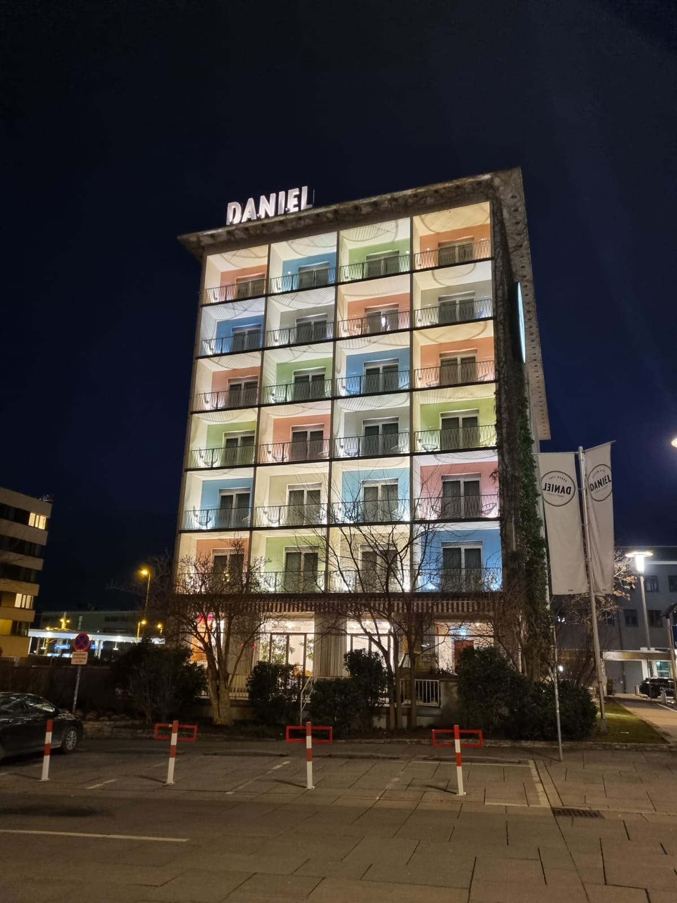

# Mi guía de dónde comer o cenar en Graz, Austria

| Nombre              | Tipo de comida               | Descripción                                                                                                               | Calificación | Cómo llegar                                                                                                               |
|---------------------|------------------------------|---------------------------------------------------------------------------------------------------------------------------|--------------|---------------------------------------------------------------------------------------------------------------------------|
| **Koko**            | China                        | Buffet bueno, bonito y barato.                                                                                            | 4.0          | Caminar por Annenstrasse hacia el centro.                                                                                 |
| **Santa Catharina** | Italiana                     | Pizzas y comida Italiana                                                                                                  | 3.5          | Está en el centro, cruzando el río.                                                                                       |
| **Goldenen Kugel**  | Austriaca                    | Todo tipo de schnitzels.  Es buena opción por su cercanía y porque cierran tarde.                                         | 3.5          | Está enfrente del Hotel Daniel.                                                                                           |
| **Granola**         | Hamburguesas y cocina simple | Es buena opción por su cercanía y porque cierran tarde.  Las hamburguesas están bien.  La tarta de manzana está muy rica. | 3.5          | Está enfrente del Hotel Daniel.                                                                                           |
| **Brot & Spiele**   | Hamburguesas y cervezas      | Tienen muchas variedades de hamburguesas y también de cervezas.                                                           | 3.5          | Caminar por Annenstrasse hacia el centro y antes de llegar al río, caminar a la izquierda.                                |
| **Best Food Grill** | Kebabs y comida Turca        | Bueno, bonito y barato.  Está rico como opción de comida rápida                                                           | 4.0          | Esté enfrente del restaurante The Italian.                                                                                |
| **The Italian**     | Italiana y pizzas            | Está muy rico y cerca.  Cierran tarde.                                                                                    | 4.0          | Está al lado del hotel Ibis.                                                                                              |
| **Lend-Platzl**     | Austriaca                    | Mi favorito.  El pollo frito está delicioso.                                                                              | 4.5          | Caminar por Annenstrasse hacia el centro.  En la calle de Volksgartenstrasse caminar a la izquierda.                      |
| **La Tavernetta**   | Italiana                     | Está muy rico.                                                                                                            | 4.0          | Caminar por Annenstrasse hacia el centro.  Está al lado de una iglesia.                                                   |
| **Osaka**           | Japonesa                     | Está muy rico y los cocineros son japoneses.                                                                              | 4.0          | Caminar por Annenstrasse hacia el centro.  En Volksgartenstrasse caminar a la izquierda.  Está al lado del Styria Center. |
| **Der Steirer**     | Austriaca                    | Tiene más fama de lo que verdaderamente ofrece.  Sí está rico, pero hasta ahí.  Hay que reservar.                         | 4.0          | Caminar por Annenstrasse hacia el centro.  En el río, caminar a la derecha una o dos calles.                              |
| **Hotel Daniel**    | Austriaca / Internacional    | El mejor desayuno.                                                                                                        | 4.5          |                                                                                                                           |
| **Hotel Kiwano** | Japonesa | Un restaurante japonés que ¡también es hotel! :heart_eyes: Alguna vez me hospedé ahí.  Queda muy cerca del aeropuerto y la comida está buenísima. | 4.0 | Está muy cerca del aeropuerto, por lo que es muy buena opción si tienes que pernoctar en Graz por alguna razón.